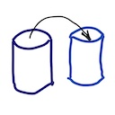

# Row copy



Performs deep row copy from one database to another, including all rows from child and parent tables.

## Purpose

Ever needed to test something locally on a couple of rows of data from staging/uat/prod data? You only need a couple of
entities, but the tables are intertwined with all the relationships, so you spend an hour copying all the required data
from a dozen different tables just to have that two rows that you're interested in. Then next day you need to do the
same, but with different rows. And you've shut down your Postgres container, so the database is clean, and you need to
start from scratch.

Enters `rowcp`. Rowcp has a very limited purpose - copy a couple of rows from the table in one database into the same
table in the different database while satisfying all the dependencies. All the rows from the tables that your table has
a foreign key to, and all the rows they have a foreign key to, and all rows from the tables that have a foreign key
pointing to these two rows that you're copying and so on.

## Usage

rowcp copies table rows from the source database to the target database. Source and target schemas must be the same.
Source and target DBMS can be different. You can use rowcp to copy data from MySQL to Postgres and vice versa.

Currently, only Postgresql, Mysql, MariaDB and h2 are supported.

To copy rows run

    java -jar rowcp.jar [options] Query 

To see all supported command line arguments run rowcp with `--help` parameter.

Required parameters are `--source-connection` and `--target-connection` that specify JDBC connection string for the
source and target databases respectively.

"Query" parameter is a seed query that returns rows that need to be copied to the target database and is also required.

There are some rules this query must abide by:

- query must be a `SELECT *` query
- it must have only one table in the `FROM` clause. No joins are allowed.
- `WHERE` clause must be present to limit the number of rows selected
- it must be a valid SQL query in the SQL dialect of the source database

There is no limitation on what you can have in `WHERE` clause, but it is highly recommended to limit the number of rows
copied to be small (in the 1 to 10 range), as, depending on the number of relationships, the actual number of copied rows
can grow exponentially and rowcp is not build for speed and efficiency.

### Command line parameters

Or, at least, some of them.

`--skip-tables` - a comma-separated list of tables in the source database that are ignored. Any relationships that start
or end at this table are also ignored.

`--skip-unknown-columns` - ignore columns that do not exist in the target database's tables. Without this option,
missing columns will be treated as errors.

`--update` - allows updating target database if the row with the same primary key already exists. This is considerably
slower than default insert mode and so is not recommended.

`--chunk-size` - When reading from the source database this will limit the number of conditions in generated queries. This helps to avoid generating queries that are too large to be handled by the source server. When writing to the target database, this will set the size of the `INSERT` batches.

`--source-user` and `--target-user` - username for connecting to the source and target database respectively.  
You may also pass username as part of the connection string.

`--source-password` and `--target-password`. Password for the source or target database. If the argument to the option
is not provided then the user will be prompted to type the password. Password may be omitted completely if the database
does not require one or the password is passed as part of the connection string. For security purposes it is recommended
not to provide password as CLI or connection string parameter.

### Parameter file

All the options can be stored in a file, path to which can be passed to `--parameter-file` argument.

Parameter file must contain one option per line. The query must be the last option and separated from the rest of the
options by an empty line.

Lines starting with `#` are treated as comments and are ignored.

```
--source-connection jdbc:mariadb://some_server:3306
--source-user src_user
--source-password src_password
--target-connection jdbc:mysql://localhost:3306/database
--target-user mysql
--target-password mysql
# don't forget to remove 
--verbose 2
--skip-tables table1, table2
--skip-unknown-columns

SELECT * FROM table3 WHERE id in (1,2,3)
AND name IS NOT NULL;
```

Any options passed on command-line will override the ones specified in the parameter file.

## Limitations

Rowcp is intended to help with testing, not to copy databases. It is highly recommended that seed query select a limited
number of rows.

It is assumed that the target database is empty or almost empty and there would be no conflicts in the data. Rowcp does
not try to clean up target tables or update existing data, if there is a duplicate key situation, then copying **will**
fail (unless `--update` option is selected).

Autogenerated fields in the target database are not supported. All the autoincremented fields will be inserted as they
are in the source database.
